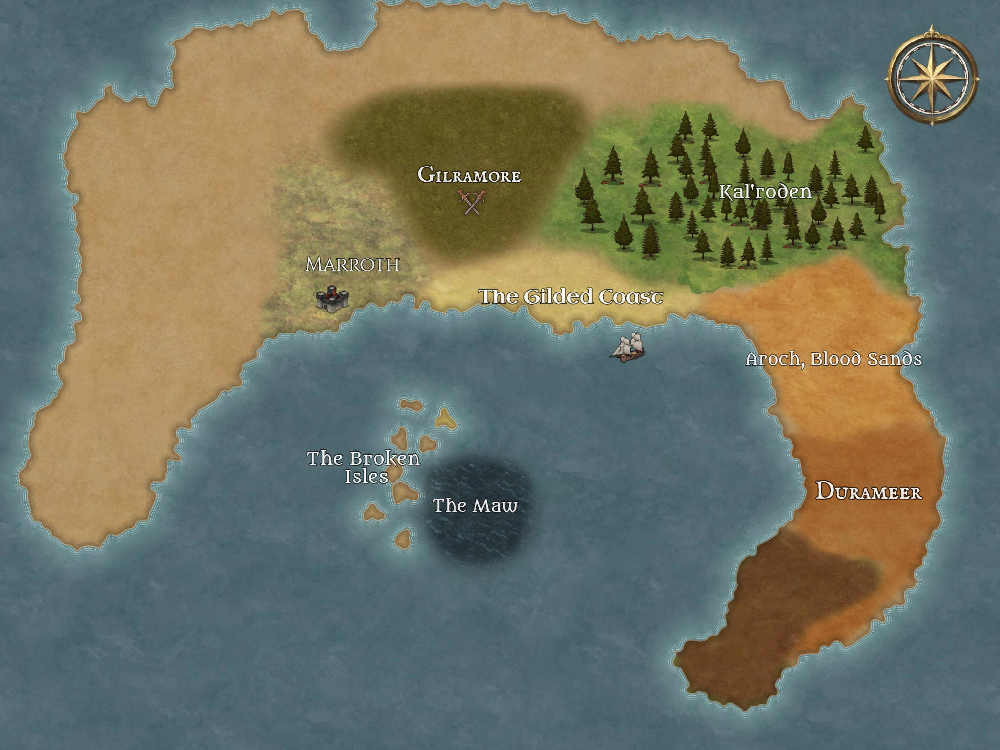
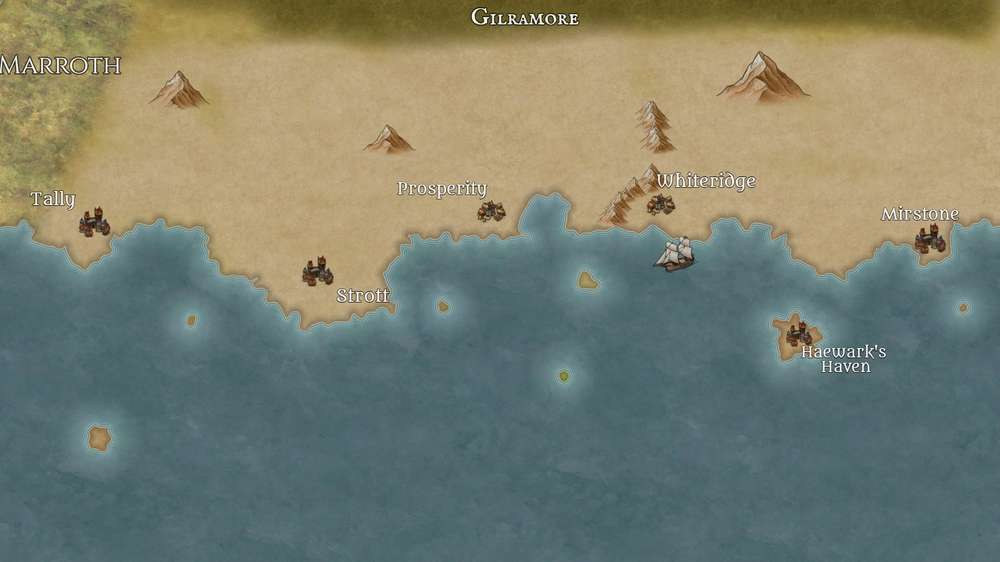
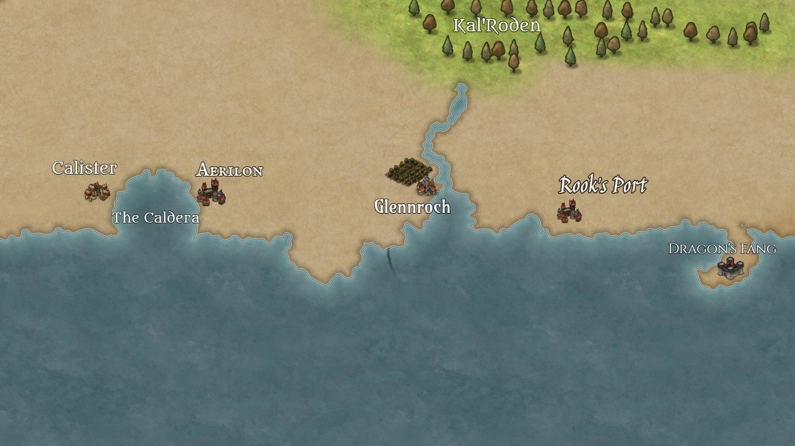
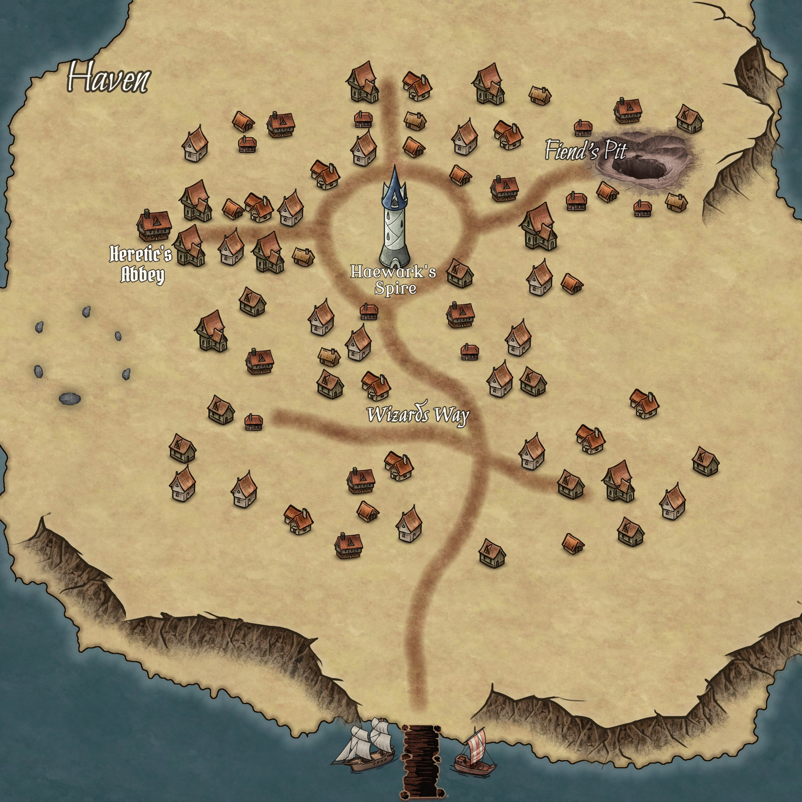
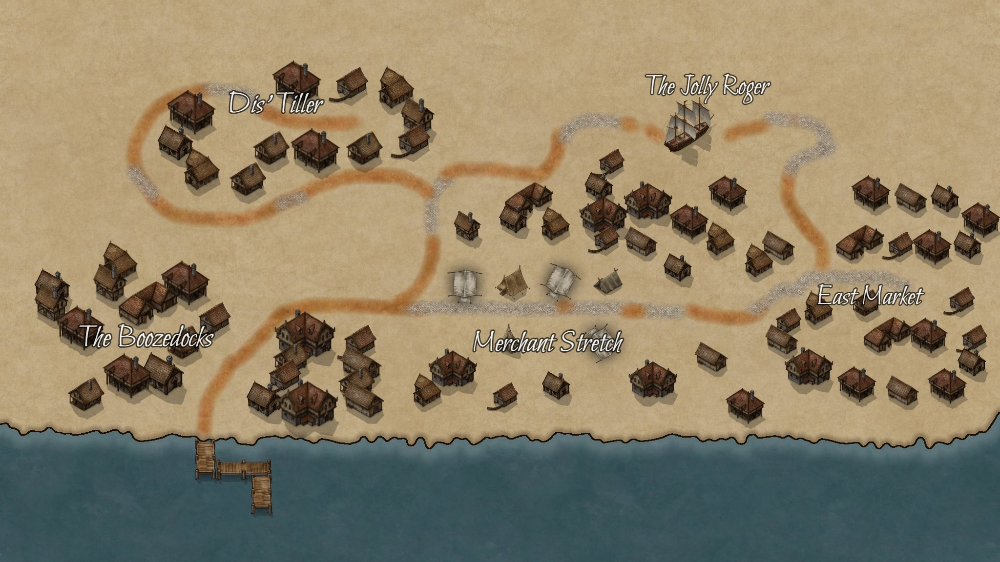
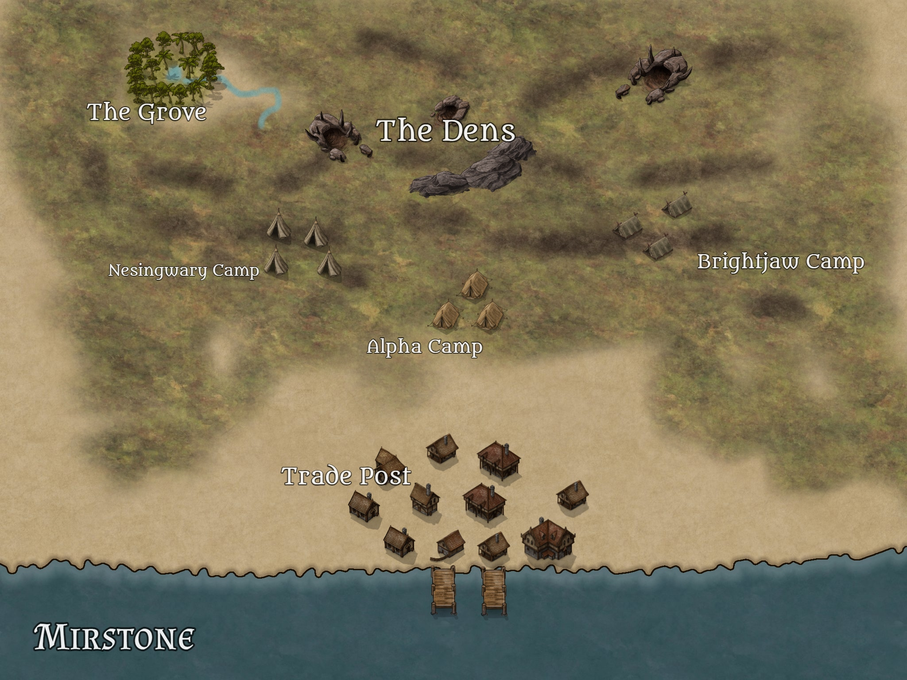
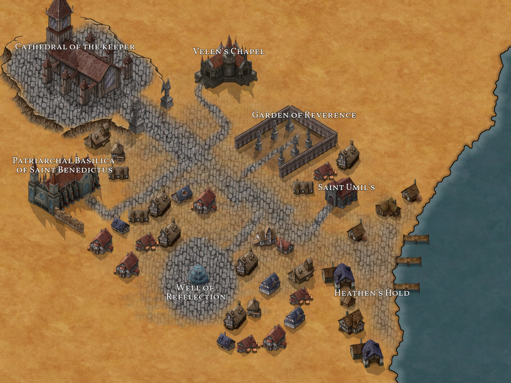

# Assets

## Maps

### The Continent Illania

### The Gilded Coast (West)

### The Gilded Coast (East)

### Haven

### Prosperity

### Mirstone

### Calister

## Other files

### Cylinder Runes

During
[The Beginning of a Grand Adventure](sessions.md#the-beginning-of-a-grand-adventure),
the crew found a [Cylinder with Runes](assets/cylinder-runes.pdf).

### Potion Legend

Between
[Spying, Pet Training Arc, Facts, and Swearing](sessions.md#spying-pet-training-arc-facts-and-swearing)
and
[Finishing up business in Haven](sessions.md#finishing-up-business-in-haven),
Haywark told offered the crew the possibility of combining
[some potions](assets/potion-effects.xlsx)

| Positive Potions            | Effect                                                                                                                                            |
| --------------------------- | ------------------------------------------------------------------------------------------------------------------------------------------------- |
| Potion of Ironskin          | AC + 6 (30s)                                                                                                                                      |
| Potion of Truesight         | Perception +10 and can see invisible entities (10mins)                                                                                            |
| Potion of Gorilla Strength  | Athl +10, any action to move an entity has adv (1min)                                                                                             |
| Potion of Flight            | Gain flying speed equal to walking speed (10 mins)                                                                                                |
| Potion of Healing           | Heal 8d4 + 12                                                                                                                                     |
| Potion of Luck              | Makes you lucky (1hour)                                                                                                                           |
| Potion of Speed             | Gain effects of Haste spell (1min)                                                                                                                |
| Potion of Heightened Mind   | Int +10, any action to solve a puzzle has adv                                                                                                     |
| Potion of Rejuevenation     | Gain 3 health at the start of your turn. Functions even when at 0HP (30s)                                                                         |
| Potion of Magic Restoration | Restore spell slots up to a total of 7 total levels (ex. One 3rd level, one fourth level)                                                         |
| Potion of Bouncing          | Become very bouncy. Gain a jump height of 20 ft. Immune to blugeoning damage, instead being pushed a number of feet equal to the damage (10 mins) |
| Potion of Invisibility      | Gain the effects of the Greater invisibility spell (1 min)                                                                                        |

| Negative Potions    | Effect                                                                                       |
| ------------------- | -------------------------------------------------------------------------------------------- |
| Potion of Polymorph | Polymorphed into a random critter (1 hour)                                                   |
| Potion of Poison    | 4d6 poison dmg poisoned (1 hour)                                                             |
| Potion of Confusion | Creature is affected by the Confusion spell (1min)                                           |
| Big Dumb Juice      | Int -10, creature is incapable of critical thinking (10min)                                  |
| Potion of Pacify    | Creature is affected by the Calm Emotions spell (10 mins)                                    |
| Potion of Shrinking | The rest of the world becomes much larger (1 hour)                                           |
| Potion of Truth     | Creature is affected by the Zone of Truth spell.They are still aware of the effect (10 mins) |
| Depresso Espresso   | Creature becomes incredibly sad (10 mins)                                                    |
| Potion of Inversion | Creature perceives everything else as upside down (10 mins)                                  |
| Glue                | Creature is under the effect of the silence spell (10mins)                                   |

| Experimental Potions | Effect |
| -------------------- | ------ |
| Something in a vial  | ???    |
